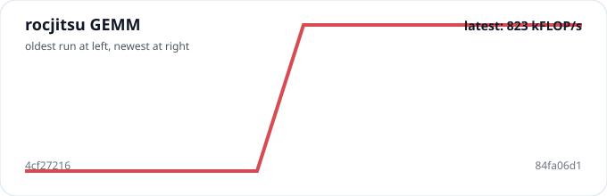
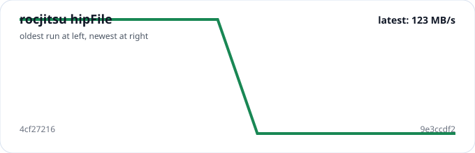
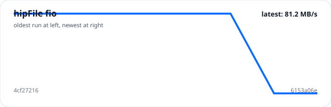

This page is generated during the Pages publish from retained benchmark history on
`gh-pages`, using the latest rocjitsu and hipFile fio report artifacts as inputs.
It mirrors the same basic model used by the ROCm/rocm-ernic site: badges for the
latest published numbers, a durable history file, and a trend page regenerated as
new CI data lands.

## Latest published snapshot

Generated from `a933df21` at **2026-09-23 04:05 UTC**.

| Metric | Latest value | Interpretation |
| --- | --- | --- |
| rocjitsu GEMM | 484 kFLOP/s | Higher is better |
| rocjitsu hipFile | 159 MB/s | Higher is better |
| hipFile fio | 147 MB/s | Higher is better |

## Trend charts

### rocjitsu GEMM

### rocjitsu hipFile

### hipFile fio

## Recent runs

| Commit | Generated | GEMM | hipFile | hipFile fio |
| --- | --- | --- | --- | --- |
| 4cf27216 | 2026-09-23 02:45 UTC | 484 kFLOP/s | 159 MB/s | 147 MB/s |
| b407b9ec | 2026-09-23 02:48 UTC | 484 kFLOP/s | 159 MB/s | 147 MB/s |
| 26a0ee18 | 2026-09-23 03:25 UTC | 484 kFLOP/s | 159 MB/s | 147 MB/s |
| a933df21 | 2026-09-23 04:05 UTC | 484 kFLOP/s | 159 MB/s | 147 MB/s |

## Current report freshness

| Report | Generated | Commit | Page |
| --- | --- | --- | --- |
| Single VM | 2026-09-23 04:04 UTC | `a933df2` | [/1vm/](/1vm/) |
| rocjitsu | 2026-09-22 23:41 UTC | `c3d041a` | [/rocjitsu/](/rocjitsu/) |
| ernic VM 1 | 2026-09-22 21:00 UTC | `13c504e` | [/two-vm/](/two-vm/) |
| ernic VM 2 | 2026-09-22 21:00 UTC | `13c504e` | [/two-vm/vm2/](/two-vm/vm2/) |
| hipFile fio | 2026-09-22 23:41 UTC | `c3d041a` | [/hipfile-fio/](/hipfile-fio/) |
