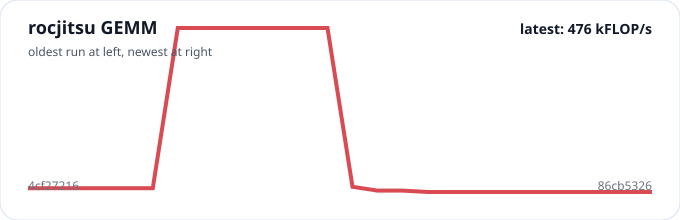
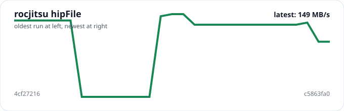
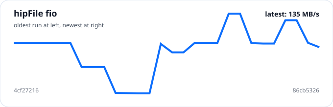

This page is generated during the Pages publish from retained benchmark history on
`gh-pages`, using the latest rocjitsu and hipFile fio report artifacts as inputs.
It mirrors the same basic model used by the ROCm/rocm-ernic site: badges for the
latest published numbers, a durable history file, and a trend page regenerated as
new CI data lands.

## Latest published snapshot

Generated from `2963e28d` at **2026-09-27 19:21 UTC**.

Badge colour is health, not branding. Each latest reading is compared against
the mean of the previous 5 *distinct* readings — consecutive
republishes of an unchanged number are collapsed first, because a publish is
triggered by any report lane finishing and re-records the other lanes' last
artifacts untouched. Green is at or above 95% of that
baseline, amber down to 80%, red below it, and blue
means there is not yet a second distinct reading to compare against. The band
is wide on purpose: these benchmarks run against an emulated GPU over
vfio-user and swing hard between runs.

| Metric | Latest value | Baseline (last 5 distinct) | Verdict |
| --- | --- | --- | --- |
| rocjitsu GEMM | 479 kFLOP/s | 598 kFLOP/s | watch (-20%) |
| rocjitsu hipFile | 162 MB/s | 148 MB/s | within tolerance (+10%) |
| hipFile fio | 121 MB/s | 51.4 MB/s | within tolerance (+135%) |

## Trend charts

### rocjitsu GEMM

### rocjitsu hipFile

### hipFile fio

## Recent runs

| Commit | Generated | GEMM | hipFile | hipFile fio |
| --- | --- | --- | --- | --- |
| e73a1e63 | 2026-09-25 13:26 UTC | 823 kFLOP/s | 123 MB/s | 81.2 MB/s |
| 6153a06e | 2026-09-25 17:51 UTC | 823 kFLOP/s | 123 MB/s | 81.2 MB/s |
| 603b8c81 | 2026-09-25 20:33 UTC | 823 kFLOP/s | 123 MB/s | 81.2 MB/s |
| fa6d8556 | 2026-09-25 23:57 UTC | 823 kFLOP/s | 123 MB/s | 11.2 MB/s |
| fa6d8556 | 2026-09-26 12:49 UTC | 823 kFLOP/s | 123 MB/s | 10.6 MB/s |
| 9e3ccdf2 | 2026-09-26 19:22 UTC | 823 kFLOP/s | 123 MB/s | 10 MB/s |
| 84fa06d1 | 2026-09-26 20:21 UTC | 823 kFLOP/s | 123 MB/s | 10 MB/s |
| 84fa06d1 | 2026-09-26 20:48 UTC | 487 kFLOP/s | 161 MB/s | 144 MB/s |
| 84fa06d1 | 2026-09-27 13:48 UTC | 479 kFLOP/s | 162 MB/s | 121 MB/s |
| 2963e28d | 2026-09-27 19:21 UTC | 479 kFLOP/s | 162 MB/s | 121 MB/s |

## Current report freshness

A report counts as green when it carries a `pass` status stamp *and* was
generated within 36 hours of the publish. Both are needed: a
lane that fails uploads no artifact at all, so its previous report stays on the
branch and would otherwise keep reading `pass` indefinitely. The badge above
shows the last date on which all 5 reports were green at once —
amber once that date is no longer today.

Last all-green: **never** &middot; checked
2026-09-27 19:26 UTC &middot; currently
not all green.

| Report | Generated | Status | Commit | Page |
| --- | --- | --- | --- | --- |
| Single VM | 2026-09-27 19:25 UTC | pass | `2963e28` | [/1vm/](/1vm/) |
| rocjitsu | 2026-09-27 13:45 UTC | unknown | `84fa06d` | [/rocjitsu/](/rocjitsu/) |
| ernic VM 1 | 2026-09-27 19:25 UTC | pass | `2963e28` | [/ernic/](/ernic/) |
| ernic VM 2 | 2026-09-27 19:25 UTC | pass | `2963e28` | [/ernic/vm2/](/ernic/vm2/) |
| hipFile fio | 2026-09-27 13:47 UTC | unknown | `84fa06d` | [/hipfile-fio/](/hipfile-fio/) |
